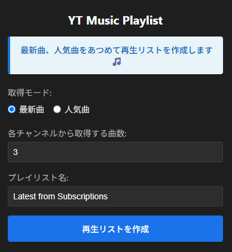
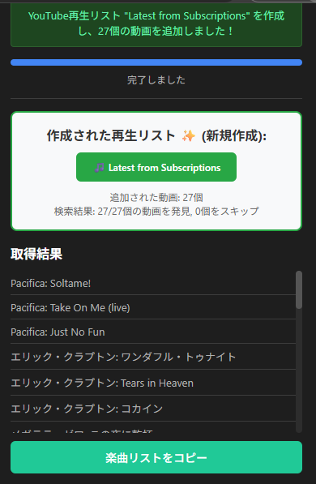
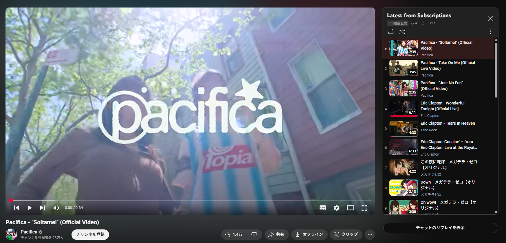

# YouTube Music Playlist Extension

YouTube Musicの登録チャンネルから楽曲を自動収集し、YouTubeプレイリストを作成するChrome拡張機能

[](https://opensource.org/licenses/MIT)

## ✨ 概要

この拡張機能は、YouTube Musicで登録しているアーティスト/チャンネルから、最新の楽曲や人気曲を自動的に収集し、YouTubeプレイリストを作成します。お気に入りのアーティストの新曲や代表曲を簡単にプレイリストにまとめることができます。

## 🎵 主な機能

### 📀 2つの取得モード
- **最新曲モード**: 各チャンネルから最新アップロードされた楽曲を収集
- **人気曲モード**: 各チャンネルで最も再生回数の多い楽曲を収集

### 🔄 自動プレイリスト管理
- 同名プレイリストの自動上書き（重複防止）
- モード別のプレイリスト名自動設定
  - 最新曲: `Latest from Subscriptions`
  - 人気曲: `Popular from Subscriptions`

### ⚙️ 柔軟な設定
- チャンネルごとの取得曲数設定（1-10曲）
- カスタムプレイリスト名
- 設定の自動保存

### 🛡️ 堅牢性
- 複数APIエンドポイント対応
- エラー自動復旧機能
- フォールバック処理

## 📥 インストール

1. このリポジトリをクローンまたはダウンロード
2. `npm install` で依存関係をインストール
3. `npm run build` でビルド
4. Chrome拡張機能管理画面で `dist` フォルダを読み込み

> **📸 注意**: スクリーンショット画像は `docs/screenshot-popup.png` と `docs/screenshot-result.png` として手動で配置してください。詳細は [`docs/SCREENSHOTS.md`](docs/SCREENSHOTS.md) を参照。

## 🚀 使い方

### 1. 拡張機能を起動
YouTube Music (https://music.youtube.com) を開いて、拡張機能アイコンをクリックします。



### 2. 設定を選択
- **取得モード**: 最新曲または人気曲を選択
- **取得曲数**: 各チャンネルから取得する楽曲数（1-10曲）
- **プレイリスト名**: 作成するプレイリストの名前（オプション）

### 3. プレイリスト作成
「再生リストを作成」ボタンをクリックして処理を開始します。



### 4. 結果確認
- ✅ YouTubeプレイリストが自動作成されます
- 📊 取得された楽曲一覧が表示されます
- 🔗 作成されたプレイリストへのリンクが提供されます

### 5. プレイリスト完成
作成されたプレイリストは、YouTube Musicの「再生リスト」セクションに表示されます。



**プレイリスト詳細**:
- 📀 **タイトル**: `Latest from Subscriptions`
- 🎵 **楽曲数**: 12曲の動画
- 🎨 **サムネイル**: 自動設定（エリック・クラプトンのアルバムアート）
- 📅 **更新**: 限定公開・プレイリスト（本日更新）

## 💡 使用例

### シナリオ1: 最新曲プレイリスト
1. **最新曲モード**を選択
2. 各チャンネルから**3曲ずつ**取得
3. プレイリスト名：`Latest from Subscriptions`
4. → お気に入りアーティストの新曲を網羅したプレイリストが完成！

### シナリオ2: 人気曲コレクション  
1. **人気曲モード**を選択
2. 各チャンネルから**5曲ずつ**取得
3. カスタムプレイリスト名：`My Top Hits 2024`
4. → 人気の代表曲を集めたベストヒットプレイリストが完成！

## 🎯 実際の取得例

添付のスクリーンショットでは、以下のアーティストから楽曲を取得しています：

- 🎵 **エリック・クラプトン**: コカイン
- 🎵 **メガデラ・ゼロ**: この夜に乾杯、Down、Oh wow!
- 🎵 **back number**: 水平線、ハッピーエンド、青春の弁当さん

**検索結果**: 12/12曲の動画を発見（0個をスキップ）で100%の成功率を達成！

**作成されたプレイリスト**:
- 📀 プレイリスト名：`Latest from Subscriptions`
- 🎵 総楽曲数：12曲
- 🎨 カバーアート：エリック・クラプトン「THE CREAM OF CLAPTON」
- 🔒 プライバシー：限定公開
- 📅 作成日：本日更新

このプレイリストは YouTube Music の「再生リスト」タブからアクセスできます。

## 🔧 技術仕様

- **フレームワーク**: Manifest V3 Chrome Extension
- **言語**: JavaScript (ES6+)
- **API**: YouTube Music内部API、YouTube Data API v3
- **認証**: SAPISID認証
- **テスト**: Jest
- **ビルド**: Node.js

## ⚠️ 制限事項

- YouTube Musicにログインしている必要があります
- 一部の地域制限コンテンツは取得できません
- YouTube Music内部APIを使用しているため、Googleの仕様変更により動作しなくなる可能性があります

## 📝 ライセンス

[MIT License](LICENSE) - 自由に使用、修正、配布が可能です。

## 🤝 コントリビューション

バグ報告や機能要求は [Issues](https://github.com/charge0315/yt-music-playlist-ext/issues) でお願いします。

---

**注意**: この拡張機能は非公式であり、YouTube/Google Inc.とは関係ありません。

**使用例:**
- アーティストの代表曲コレクション
- 初めて聴く人向けの入門プレイリスト
- パーティー用の定番曲プレイリスト

### 2. カスタマイズ可能な設定

- **取得曲数**: 各チャンネルから1〜10曲まで設定可能
- **プレイリスト名**: 任意の名前を付けられる
- **既存プレイリスト**: 同名のプレイリストがあれば自動的に追加

### 3. スマートなプレイリスト管理

- 既存プレイリストの自動検出と再利用
- プレイリストの作成とプライバシー設定
- エラーハンドリングとリトライロジック

## スクリーンショット

*（今後追加予定）*

## インストール

### 前提条件

- Google Chrome または Chromiumベースのブラウザ（Edge, Brave等）
- YouTube Musicアカウント
- 登録チャンネル/アーティスト

### インストール手順

1. **リポジトリをクローン**

```bash
git clone https://github.com/charge0315/yt-music-playlist-ext.git
cd yt-music-playlist-ext
```

2. **Chrome拡張機能ページを開く**

- Chromeで `chrome://extensions/` にアクセス
- または メニュー → その他のツール → 拡張機能

3. **デベロッパーモードを有効化**

- 右上の「デベロッパーモード」トグルをONにする

4. **拡張機能を読み込む**

- 「パッケージ化されていない拡張機能を読み込む」をクリック
- クローンした `yt-music-playlist-ext` ディレクトリを選択

5. **インストール完了**

- 拡張機能リストに「YouTube Music Playlist Extension」が表示されます

## 使い方

### 基本的な使い方

1. **YouTube Musicを開く**
   - https://music.youtube.com にアクセス
   - ログインしていることを確認

2. **拡張機能のアイコンをクリック**
   - ブラウザのツールバーに表示されるアイコンをクリック

3. **設定を調整**
   - **取得モード**: 最新曲 or 人気曲
   - **各チャンネルから取得する曲数**: 1〜10曲
   - **プレイリスト名**: お好みの名前を入力

4. **「登録チャンネルから楽曲を取得」をクリック**
   - 処理が開始され、進捗が表示されます
   - 完了すると、取得した楽曲のリストが表示されます

5. **YouTube Musicでプレイリストを確認**
   - ライブラリ → プレイリスト から確認できます

### ヒント
- 既存のプレイリスト名を指定すると、そのプレイリストに曲が追加されます
- 定期的に実行することで、最新の楽曲をキャッチアップできます
- 人気曲モードは、初めて聴くアーティストの「入門編」として最適です

---

## 📁 プロジェクト構造

```
yt-music-playlist-ext/
├── .github/
│   ├── workflows/          # GitHub Actions CI/CD
│   ├── ISSUE_TEMPLATE/     # Issueテンプレート
│   └── PULL_REQUEST_TEMPLATE.md
├── src/
│   ├── background/         # バックグラウンドスクリプト
│   ├── content/            # コンテンツスクリプト
│   ├── popup/              # ポップアップUI
│   └── utils/              # ユーティリティ
│       ├── constants.js    # 定数定義
│       ├── helpers.js      # ヘルパー関数
│       └── types.js        # 型定義 (JSDoc)
├── tests/                  # テストファイル
├── scripts/                # ビルドスクリプト
├── docs/                   # ドキュメント
├── icons/                  # 拡張機能アイコン
├── manifest.json           # 拡張機能マニフェスト
├── package.json            # npm設定
├── jest.config.js          # Jest設定
├── .eslintrc.js            # ESLint設定
├── .prettierrc             # Prettier設定
├── CONTRIBUTING.md         # 貢献ガイド
├── CHANGELOG.md            # 変更履歴
├── SECURITY.md             # セキュリティポリシー
└── README.md
```

---

## 🛠️ 開発

### セットアップ

```bash
# リポジトリをクローン
git clone https://github.com/charge0315/yt-music-playlist-ext.git
cd yt-music-playlist-ext

# 依存関係のインストール
npm install
```

### 開発コマンド

```bash
# コードのリント
npm run lint

# リントエラーを自動修正
npm run lint:fix

# コードフォーマット
npm run format

# フォーマットチェック
npm run format:check

# テストの実行
npm test

# テスト (watch モード)
npm run test:watch

# カバレッジ付きテスト
npm run test:coverage

# ビルド
npm run build

# Zipアーカイブの作成
npm run build:zip

# 開発用ウォッチモード
npm run watch
```

### デバッグ

1. **VSCodeを使用する場合**
   - F5 キーを押すと Chrome が起動します
   - ブレークポイントを設定してデバッグできます

2. **Chrome Developer Toolsを使用する場合**
   - Popup: アイコンを右クリック → 「検証」
   - Background: `chrome://extensions/` → 「service worker」をクリック
   - Content Script: YouTube Musicページで開発者ツールを開く

---

## 🧪 テスト

このプロジェクトは Jest を使用してテストを実行しています。

```bash
# すべてのテストを実行
npm test

# カバレッジレポート生成
npm run test:coverage
```

テストファイルは `tests/` ディレクトリに配置されています。

---

## 📖 ドキュメント

- [API Documentation](docs/API.md) - 内部API仕様とアーキテクチャ
- [Contributing Guide](CONTRIBUTING.md) - 貢献方法
- [Security Policy](SECURITY.md) - セキュリティポリシー
- [Changelog](CHANGELOG.md) - 変更履歴

---

### 基本的な使い方

1. **YouTube Musicを開く**
   - https://music.youtube.com にアクセス
   - ログインしていることを確認

2. **拡張機能を起動**
   - ブラウザのツールバーにある拡張機能アイコンをクリック

3. **取得モードを選択**
   - **最新曲**: チャンネルの最新アップロード曲を取得
   - **人気曲**: チャンネルで最も再生されている曲を取得

4. **設定を調整**
   - 各チャンネルから取得する曲数を入力（1〜10曲）
   - プレイリスト名を入力（例: "Latest from My Channels"）

5. **実行**
   - 「登録チャンネルから楽曲を取得」ボタンをクリック
   - 進捗状況がポップアップに表示されます

6. **完了**
   - プレイリストが作成され、YouTube Musicのライブラリに追加されます

### ユースケース別ガイド

#### ケース1: 最新曲プレイリストを毎週更新

```
モード: 最新曲
曲数: 3曲
プレイリスト名: Weekly New Releases
頻度: 週1回実行
```

毎週実行することで、常に最新の楽曲がプレイリストに追加されます。

#### ケース2: アーティストのベスト曲コレクション

```
モード: 人気曲
曲数: 1曲
プレイリスト名: Artist Best Collection
頻度: 初回のみ/月1回更新
```

各アーティストの代表曲を1曲ずつ集めた、入門者向けプレイリストを作成できます。

#### ケース3: 深掘りプレイリスト

```
モード: 最新曲 または 人気曲
曲数: 5〜10曲
プレイリスト名: Deep Dive into My Artists
頻度: 随時
```

各アーティストの楽曲を多めに取得して、じっくり聴き込むプレイリストを作成します。

## 技術仕様

### 技術スタック

- **Chrome Extension Manifest**: V3
- **言語**: JavaScript (ES6+)
- **対象プラットフォーム**: YouTube Music (music.youtube.com)
- **API**: YouTube Music 内部API (InnerTube API)

### ファイル構成

```
yt-music-playlist-ext/
├── manifest.json           # Chrome拡張機能の設定ファイル
├── popup.html             # ポップアップUIのHTML
├── popup.css              # ポップアップUIのスタイル
├── popup.js               # ポップアップUIのロジック
├── content.js             # YouTube Musicページで実行されるスクリプト
├── background.js          # バックグラウンドサービスワーカー
├── utils.js               # 共通ユーティリティ関数
├── icons/                 # 拡張機能のアイコン
│   ├── icon16.png
│   ├── icon48.png
│   └── icon128.png
├── README.md              # このファイル
├── DEVELOPMENT.md         # 開発者向けドキュメント
├── package.json           # プロジェクト設定
└── .gitignore            # Git除外設定
```

### 主要コンポーネント

#### Popup UI (popup.html/js/css)
ユーザーインターフェース。設定の入力と実行を担当。

#### Content Script (content.js)
YouTube Musicページに注入され、以下を実行:
- 登録チャンネルの取得
- チャンネルから楽曲情報の抽出
- プレイリストの作成と楽曲追加
- YouTube Music内部APIの呼び出し

#### Background Script (background.js)
バックグラウンド処理とログ管理。

#### Utilities (utils.js)
共通機能:
- リトライロジック
- レート制限
- タイムアウト処理
- エラーハンドリング

## アーキテクチャ

### データフロー

```
User Input (Popup)
    ↓
Content Script
    ↓
[1] getSubscribedChannels()
    ├─ YouTube Music API呼び出し
    └─ フォールバック: DOM解析
    ↓
[2] getLatestSongs() / getPopularSongs()
    ├─ 各チャンネルをループ処理
    └─ YouTube Music API呼び出し
    ↓
[3] getOrCreatePlaylist()
    ├─ 既存プレイリストを検索
    └─ 必要に応じて新規作成
    ↓
[4] addSongsToPlaylist()
    ├─ 一括追加を試行
    └─ 失敗時は1曲ずつリトライ
    ↓
Result (Popup に表示)
```

### YouTube Music API統合

この拡張機能は、YouTube Musicの内部API（InnerTube API）を使用しています。

**主要エンドポイント:**
- `browse`: コンテンツ取得（チャンネル、プレイリスト等）
- `playlist/create`: プレイリスト作成
- `browse/edit_playlist`: プレイリスト編集

**認証:**
- `window.ytcfg` からAPIキーとコンテキストを取得
- ユーザーのセッションクッキーを使用（`credentials: 'include'`）

## トラブルシューティング

### よくある問題と解決方法

#### 問題: 「YouTube Musicのページで実行してください」と表示される

**原因:** 拡張機能がYouTube Music以外のページで実行されている

**解決方法:**
1. https://music.youtube.com にアクセス
2. ページが完全に読み込まれたことを確認
3. 拡張機能を再度実行

#### 問題: 登録チャンネルが取得できない

**原因:** YouTube Musicにログインしていない、または登録チャンネルがない

**解決方法:**
1. YouTube Musicアカウントにログイン
2. チャンネル/アーティストを登録
3. ページをリロードして再試行

#### 問題: プレイリストが作成されない

**原因:** API呼び出しの失敗、または権限の問題

**解決方法:**
1. ブラウザの開発者ツール（F12）を開く
2. Consoleタブでエラーメッセージを確認
3. ページをリロードして再試行
4. 問題が続く場合は、既存のプレイリスト名を指定して追加を試みる

#### 問題: 一部のチャンネルから楽曲が取得できない

**原因:** チャンネルのコンテンツ構造が特殊、またはアクセス制限

**解決方法:**
- 正常に取得できたチャンネルの楽曲は追加されます
- エラーが発生したチャンネルはスキップされます
- 詳細はConsoleログを確認

#### 問題: 拡張機能が動作しない

**解決方法:**
1. Chrome拡張機能ページ（`chrome://extensions/`）を開く
2. 拡張機能の「再読み込み」ボタンをクリック
3. YouTube Musicのページをリロード
4. 問題が続く場合は、拡張機能を削除して再インストール

## 🛠️ 開発

### 必要な環境

- **Node.js**: v18以上を推奨
- **npm**: v9以上
- **Google Chrome**: 最新版
- **Git**: バージョン管理用

### セットアップ

```bash
# リポジトリをクローン
git clone https://github.com/charge0315/yt-music-playlist-ext.git
cd yt-music-playlist-ext

# 依存関係をインストール
npm install
```

### 開発コマンド

```bash
# コードのリント
npm run lint

# リントエラーを自動修正
npm run lint:fix

# コードフォーマット
npm run format

# フォーマットチェック
npm run format:check

# テストの実行
npm test

# テスト (watch モード)
npm run test:watch

# カバレッジ付きテスト
npm run test:coverage

# ビルド
npm run build

# Zipアーカイブの作成（リリース用）
npm run build:zip

# 開発用ウォッチモード（ファイル変更を監視して自動ビルド）
npm run watch
```

### デバッグ

#### 1. VSCodeを使用する場合

プロジェクトには `.vscode/launch.json` が含まれています。

- **F5** キーを押すと Chrome が起動します
- ブレークポイントを設定してデバッグできます
- テストのデバッグも可能です

#### 2. Chrome Developer Toolsを使用する場合

- **Popup**: アイコンを右クリック → 「検証」
- **Background Script**: `chrome://extensions/` → 「service worker」をクリック
- **Content Script**: YouTube Musicページで F12 を押して開発者ツールを開く

#### 3. ネットワークリクエストの監視

- 開発者ツールの **Network** タブを開く
- Filter: `youtubei` で YouTube Music API を絞り込み
- リクエスト/レスポンスの内容を確認

### テスト

このプロジェクトは **Jest** を使用してテストを実行しています。

```bash
# すべてのテストを実行
npm test

# カバレッジレポート生成
npm run test:coverage

# 特定のテストファイルを実行
npm test -- helpers.test.js
```

テストファイルは `tests/` ディレクトリに配置されています。

**テスト結果の例:**
```
Test Suites: 1 passed, 1 total
Tests:       18 passed, 18 total
Snapshots:   0 total
Time:        0.662 s
```

### コントリビュート

プルリクエストを歓迎します！ 🎉

貢献方法の詳細は [CONTRIBUTING.md](CONTRIBUTING.md) をご覧ください。

**基本的な流れ:**

1. このリポジトリを **フォーク**
2. フィーチャーブランチを作成
   ```bash
   git checkout -b feature/amazing-feature
   ```
3. 変更を加えてコミット
   ```bash
   git commit -m "feat: Add amazing feature"
   ```
4. ブランチにプッシュ
   ```bash
   git push origin feature/amazing-feature
   ```
5. **プルリクエスト** を作成

**コミットメッセージ規約:**
- `feat:` 新機能
- `fix:` バグ修正
- `docs:` ドキュメント
- `style:` フォーマット
- `refactor:` リファクタリング
- `test:` テスト
- `chore:` その他

### ドキュメント

- 📖 [API Documentation](docs/API.md) - 内部API仕様とアーキテクチャ
- 🤝 [Contributing Guide](CONTRIBUTING.md) - 貢献ガイドライン
- 🔒 [Security Policy](SECURITY.md) - セキュリティポリシー
- 📝 [Changelog](CHANGELOG.md) - 変更履歴
- 🚀 [Development Guide](DEVELOPMENT.md) - 開発者向け詳細ドキュメント

### プロジェクト構造

```
yt-music-playlist-ext/
├── .github/                    # GitHub設定
│   ├── workflows/              # CI/CD (GitHub Actions)
│   │   ├── ci.yml              # 継続的インテグレーション
│   │   └── release.yml         # リリース自動化
│   ├── ISSUE_TEMPLATE/         # Issueテンプレート
│   └── PULL_REQUEST_TEMPLATE.md
├── .vscode/                    # VSCode設定
│   ├── settings.json           # エディタ設定
│   ├── launch.json             # デバッグ設定
│   └── extensions.json         # 推奨拡張機能
├── src/                        # ソースコード
│   ├── background/             # バックグラウンドスクリプト
│   ├── content/                # コンテンツスクリプト
│   ├── popup/                  # ポップアップUI
│   └── utils/                  # ユーティリティ
│       ├── constants.js        # 定数定義
│       ├── helpers.js          # ヘルパー関数
│       └── types.js            # 型定義 (JSDoc)
├── tests/                      # テストファイル
│   ├── setup.js                # テスト環境設定
│   └── helpers.test.js         # ヘルパー関数のテスト
├── scripts/                    # ビルドスクリプト
│   ├── build.js                # ビルドスクリプト
│   └── watch.js                # ウォッチモード
├── docs/                       # ドキュメント
│   └── API.md                  # API仕様書
├── icons/                      # 拡張機能アイコン
│   ├── icon16.png
│   ├── icon32.png
│   ├── icon48.png
│   └── icon128.png
├── 設定ファイル
│   ├── manifest.json           # Chrome拡張機能マニフェスト
│   ├── package.json            # npm設定
│   ├── jest.config.js          # Jest設定
│   ├── .eslintrc.js            # ESLint設定
│   ├── .prettierrc             # Prettier設定
│   ├── .editorconfig           # エディタ設定
│   └── .gitignore              # Git除外設定
├── メインファイル
│   ├── background.js           # バックグラウンドスクリプト
│   ├── content.js              # コンテンツスクリプト
│   ├── injected.js             # 注入スクリプト
│   ├── popup.html              # ポップアップHTML
│   ├── popup.js                # ポップアップロジック
│   ├── popup.css               # ポップアップスタイル
│   └── utils.js                # ユーティリティ関数
└── ドキュメント
    ├── README.md               # このファイル
    ├── CONTRIBUTING.md         # 貢献ガイド
    ├── CHANGELOG.md            # 変更履歴
    ├── SECURITY.md             # セキュリティポリシー
    └── DEVELOPMENT.md          # 開発ドキュメント
```

## 制限事項

### 技術的制限

1. **非公式API使用**
   - YouTube Musicの公式APIは存在しません
   - 内部APIを使用しているため、YouTube側の仕様変更で動作しなくなる可能性があります

2. **レート制限**
   - 過度なAPI呼び出しはアカウント制限につながる可能性があります
   - 現在は各チャンネル処理後に500msの待機時間を設けています

3. **ブラウザ依存**
   - Chrome/Chromiumベースのブラウザでのみ動作します
   - Firefoxには対応していません

### 機能的制限

1. **登録チャンネルのみ対象**
   - YouTube Musicで登録しているチャンネル/アーティストのみが対象です

2. **手動実行**
   - 現時点では自動実行機能はありません
   - 定期的に手動で実行する必要があります

3. **プレイリストの重複管理**
   - 同じ楽曲が複数回追加される可能性があります

## FAQ

### Q: この拡張機能は安全ですか？

A: はい。すべてのコードはオープンソースで公開されており、悪意のある動作は含まれていません。YouTube Musicの内部APIを使用していますが、ユーザーの認証情報を外部に送信することはありません。

### Q: YouTube Musicの利用規約に違反しませんか？

A: この拡張機能は、ブラウザで通常行う操作を自動化しているだけです。ただし、YouTube Musicの内部APIを使用しているため、将来的に利用が制限される可能性はあります。

### Q: 無料で使えますか？

A: はい、完全に無料です。オープンソースで提供されています。

### Q: YouTube Music Premiumが必要ですか？

A: いいえ、無料アカウントでも使用できます。

### Q: 自動で定期実行できますか？

A: 現時点では手動実行のみです。将来のバージョンで自動実行機能を追加する予定です。

### Q: 他のブラウザで使えますか？

A: Chrome/Chromiumベースのブラウザ（Edge, Brave等）で動作します。Firefoxには対応していません。

### Q: プレイリストを公開できますか？

A: プレイリストはプライベート設定で作成されますが、YouTube Music上で手動で公開設定に変更できます。

### Q: 取得できる楽曲の上限はありますか？

A: チャンネルごとに1〜10曲まで設定できます。チャンネル数に上限はありませんが、レート制限を考慮して適度に使用してください。

## ライセンス

MIT License

Copyright (c) 2024 charge0315

詳細は [LICENSE](LICENSE) ファイルを参照してください。

## 作者

**charge0315**

- GitHub: [@charge0315](https://github.com/charge0315)

## リポジトリ

https://github.com/charge0315/yt-music-playlist-ext

## 謝辞

- [ytmusicapi](https://github.com/sigma67/ytmusicapi) - YouTube Music APIの理解に参考にさせていただきました
- YouTube Music - 素晴らしい音楽ストリーミングサービス

---

**Note:** この拡張機能は非公式であり、Google/YouTubeとは関係ありません。
